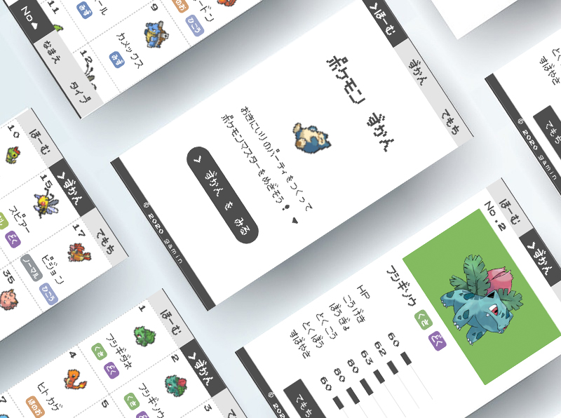
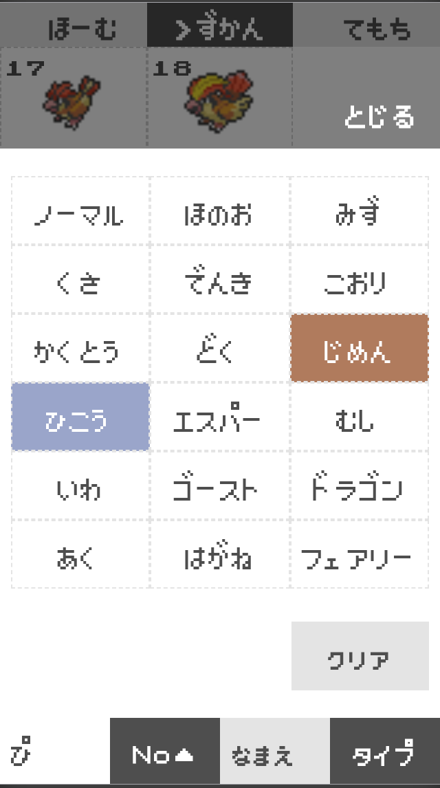
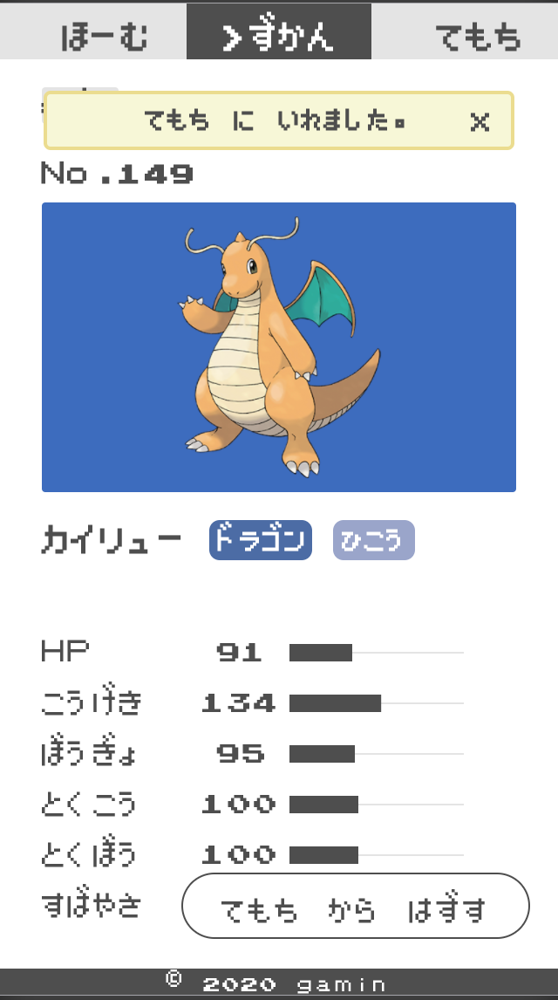

# pokemon-zukan
  ポケモンのパーティを編成できるSingle Page App.

  デモページはこちら→[ぽけもんずかん](https://gamin27.github.io/pokemon-zukan/)

  

## 技術・API
  * Vue-CLI
  * Vuex
  * PokeAPI
  * pokemonJSON

## 高速検索機能
  名前検索の他にタイプで絞り込みができます。
  また、番号順や名前順にソートできます。

  

## ポケモンを手持ちに登録
  ポケモンのステータスを確認できます。
  手持ちに加えたいポケモンを選択し、パーティに加えましょう。

  


## Build Setup

``` bash
# install dependencies
npm install

# serve with hot reload at localhost:8080
npm run dev

# build for production with minification
npm run build

# build for production and view the bundle analyzer report
npm run build --report
```
## setting output file

```js
// config/index.js
  build: {
    // Template for index.html
    index: path.resolve(__dirname, '../docs/index.html'),// update

    // Paths
    assetsRoot: path.resolve(__dirname, '../docs'), //update
    assetsSubDirectory: 'static',
    assetsPublicPath: './pokemon-zulan', //update
    //省略
  }
```

For a detailed explanation on how things work, check out the [guide](http://vuejs-templates.github.io/webpack/) and [docs for vue-loader](http://vuejs.github.io/vue-loader).
